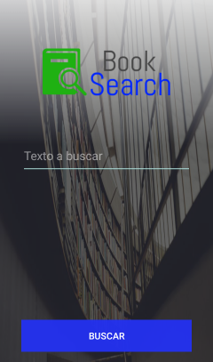

# Master Detail Example

In developing progress...

The application is an example of Clean Architecture with MVP ( Model-View-Presenter).

### Built with:

* **Data Source:** [OpenLibrary]
* **Dependency Injection:** [Dagger2] 
* **View Injection:** [ButterKnife]
* **Http Client:** [Retrofit2]
* **Image loader:** [Glide]

## Screenshots

### Develop by Jose Luis Balanza

* [LinkedIn]

[LinkedIn]: <https://es.linkedin.com/in/jose-luis-balanza-b9246950>
[OpenLibrary]: <https://openlibrary.org/developers/api>
[Dagger2]: <http://google.github.io/dagger/>
[ButterKnife]: <http://jakewharton.github.io/butterknife/>
[Retrofit2]: <http://square.github.io/retrofit/>
[Glide]: <https://github.com/bumptech/glide>

